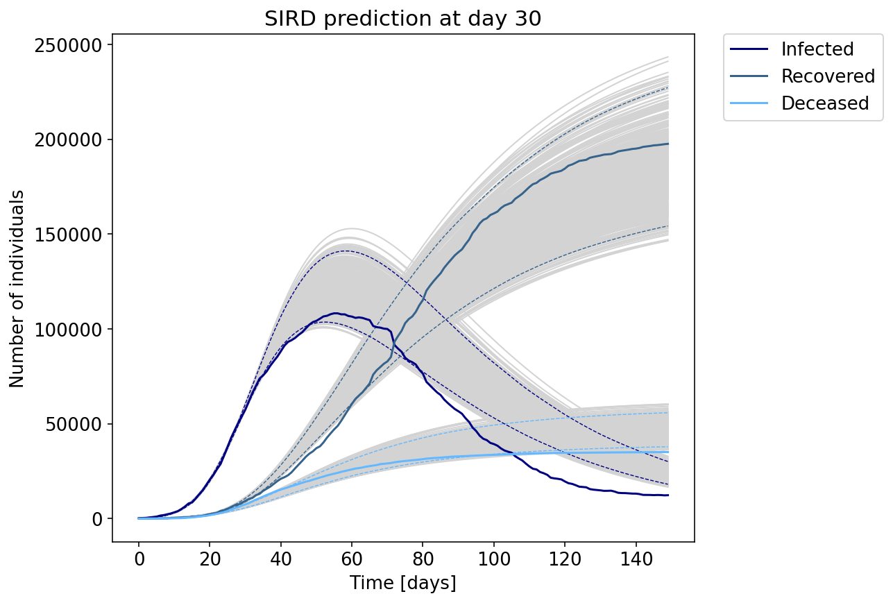
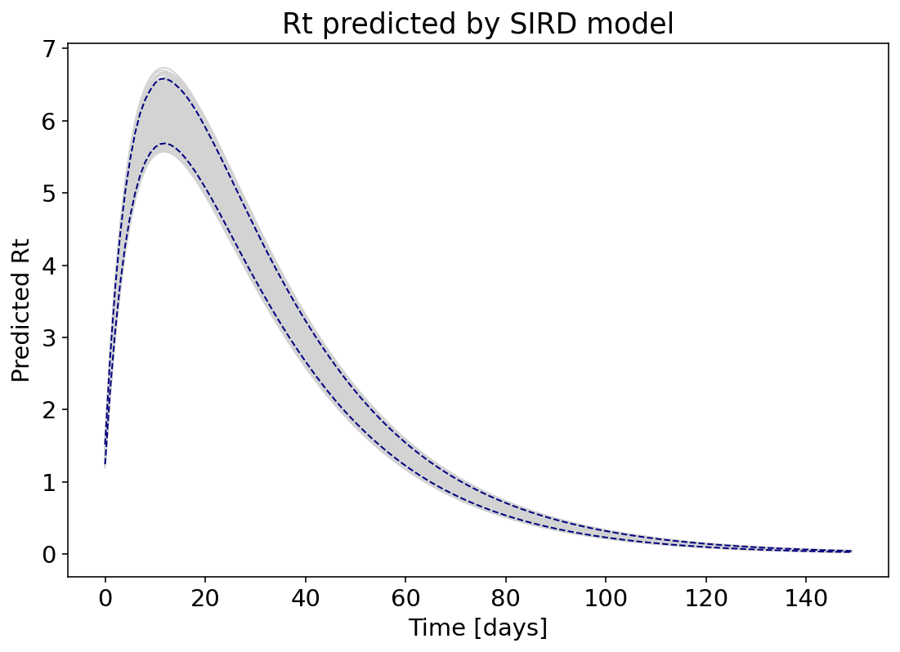
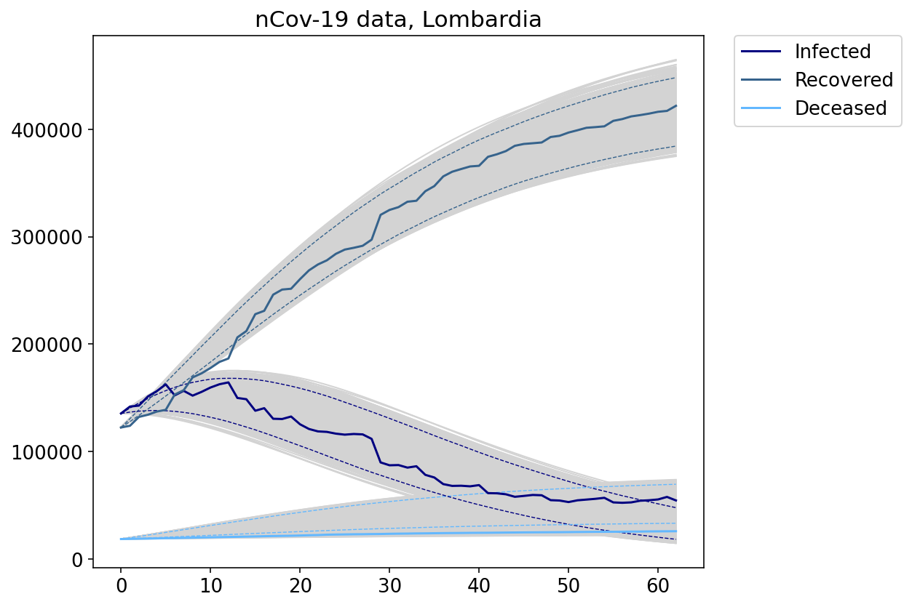
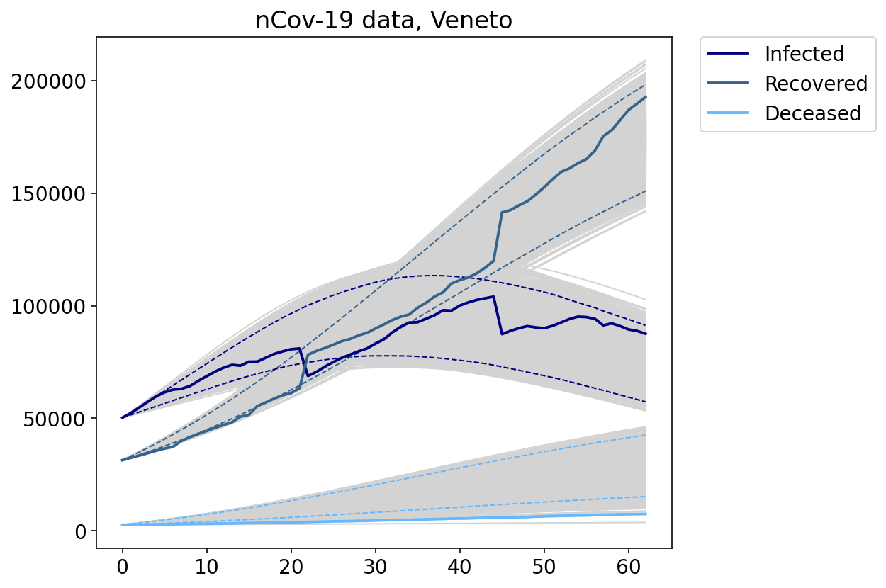

# Bayesian data-driven model discovery under uncertainty

Project for the Bayesian Statistics Course 2020/2021 held @ Politecnico di Milano by Professor Alessandra Guglielmi, Doctor Riccardo Corradin, Doctor Mario Beraha

Developed by: Federico Fatone, Filippo Fedeli, Michela Ceoloni under supervision of Professor Andrea Manzoni.

## Contents 
This project aims to provide a Bayesian framework for model discovery under uncertainty.

In the folder eABCSMC, we define the classes Preconditioner and EABCSMC (for epidemiological models), which constitute the core of the presented e-ABC-SMC method, a new, improved version of the ABC-SMC framework, originally presented in Toni et Al. [2].

An example of their intuitive, end to end usage can be found in the folder Epidemics_response/Examples, where a SIRD/SEIRD model is fitted for the Covid-19 first outbreak in Italy and Spain.
All the results contained in the report can be reproduced by running the relevant notebooks/scripts, found in LV for the comparison on simulate data between the framework presented in Perdikaris et al. [1] (LV/Perdikaris) and in Epidemics_Models/Examples for the other relevant results.

The code is developed in Python, for the relevant Python libraries, please refer to requirements.txt and run
```
pip install -r requirements.txt 
```
 
If you have any other question, please contact federico.fatone@mail.polimi.it, filippo.fedeli@mail.polimi.it, michela.ceoloni@mail.polimi.it

## Main Results

We hereby show some of the main quantitative results. For methodological questions about HMC, e-ABC-SMC and their comparison, please refer to the report.

Our main objective was trying to predict the epidemic course of the disease using only data from the first 30 days (data from 24/02/2020 to 25/03/2020), with a great attention paid to the time and magnitude of the peak of infected individuals, which is of paramount importance in order to decide the harshness and duration of countermeasures and provide reliable estimation of the maximum load on hospitals and healthcare system. Looking at the literature, we decide to first fit a SIRD model for the prediction in a hard lockdown situation,adopting the functional forms described in Section 3.1 of the report, leveraging on the prior information on the pandemic in China. The resulting fit is really accurate for all the compartments, and it manages to capture the exact location in time of the peak, estimating it at 95% confidence between 52 and 58 days. We highlight that the peak occurred, actually, at day t= 55, and that predictions carried out after 30 days from the outbreak start last spring had estimated the peak ten days earlier, with a much lower amount of infected individuals. 

<p align="middle">
  
</p>

It is also interesting to see the estimated behavior of the often quoted Rt parameter, which is one of the main indicators of the spread of the epidemic. From the figure below, we see how our framework provides a credible estimate for the peak’s location in time,locating it with 95 % confidence to the interval (10,11), which corresponds to the exact weekend when the total lockdown started in Lombardy, however slightly overestimating the absolute valueof Rt at peak.

<p align="middle">
  
</p>

During the \textit{second wave} in Fall 2020, the Italian Government introduced a colour code for the classification of risk for each Region and adopted, consequently, different restrictive measurements according to that classification.
One other interesting application is in the application of our framework to this data, trying to understand whether there were differences between different coloured zones, and if the different enforced restrictions indeed had different impacts. 
<p float="left">
  
  
</p>

As we see, we obtain a meaningful fit and, testing for the two regions the two alternative hypotheses,

H0: beta(t) increasing vs H1: beta(t) decreasing

by performing the tests on our sampled posterior distributions, we obtained the following Bayes Factors for the test: 

Lombardia: 2log(BF_{0,1}): -2.54

Veneto: 2log(BF_{0,1}): 2.59

thus confirming a general increase in the contagion speed in Veneto and a general decrease in Lombardia, while always finding a lower mean beta in Lombardia than in Veneto. The presented analysis thus suggests that a classification of regions according different degrees of severity of the epidemic trend was justified, however implying extremely outcomes and medium-term evolutions, too.

## Main References

[1] Y. Yang, M.A. Bhouri, P. Perdikaris (2020). Bayesian differential programming for robust systems identification under uncertainty. ArXiv pre-print, submitted to Proceedings of the Royal Society A.

[2] Toni, T., Welch, D., Strelkowa, N., Ipsen, A., Stumpf, M. P. (2009).  Approximate Bayesian Computation scheme for parameter inference and model selection in dynamical systems. Journal of the Royal Society Interface 6(31), 187-202


